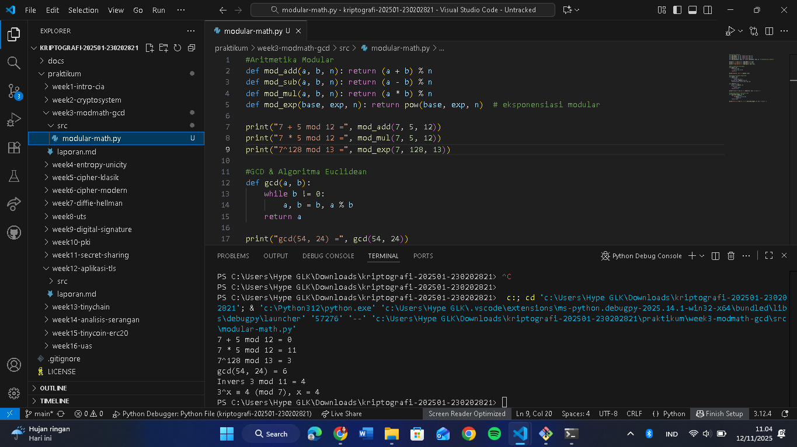

# Laporan Praktikum Kriptografi
Minggu ke-: 3
Topik: [03 Modular Math (Aritmetika Modular, GCD, Bilangan Prima, Logaritma Diskrit)]  
Nama: [Sri Rahayu]  
NIM: [230202821]  
Kelas: [5IKRB]  

---

## 1. Tujuan
Setelah mengikuti praktikum ini, mahasiswa diharapkan mampu:

1. Menyelesaikan operasi aritmetika modular.
2. Menentukan bilangan prima dan menghitung GCD (Greatest Common Divisor).
3. Menerapkan logaritma diskrit sederhana dalam simulasi kriptografi.

---

## 2. Dasar Teori
Cipher klasik adalah metode penyandian tradisional yang menggunakan algoritma sederhana untuk mengubah pesan asli (plaintext) menjadi pesan yang tidak bisa dimengerti (ciphertext) dengan tujuan menjaga kerahasiaan. Contoh cipher klasik adalah Caesar cipher, substitution cipher, dan transposition cipher, yang biasanya melibatkan penggantian atau penggeseran huruf sesuai aturan tertentu.

Aritmetika modular adalah konsep matematika yang berhubungan dengan bilangan bulat dan sisa pembagian terhadap suatu bilangan tetap yang disebut modulus. Dalam aritmetika modular, perhitungan dilakukan berdasarkan sisa hasil pembagian, sehingga hasilnya "berputar" kembali ke nol setelah mencapai nilai modulus tertentu. Dua bilangan dikatakan kongruen modulo n jika selisihnya merupakan kelipatan dari n. Konsep ini sangat penting dalam kriptografi, termasuk dalam cipher klasik, dimana misalnya huruf-huruf alfabet yang dipetakan ke angka 0 hingga 25 kemudian hasil operasi dijaga agar selalu dalam rentang angka tersebut menggunakan aritmetika modular.

---

## 3. Alat dan Bahan
(- Python 3.x  
- Visual Studio Code / editor lain  
- Git dan akun GitHub  

---

## 4. Langkah Percobaan
(Tuliskan langkah yang dilakukan sesuai instruksi.  
Contoh format:
1. Membuat file `caesar_cipher.py` di folder `praktikum/week2-cryptosystem/src/`.
2. Menyalin kode program dari panduan praktikum.
3. Menjalankan program dengan perintah `python caesar_cipher.py`.)

---

## 5. Source Code
(Salin kode program utama yang dibuat atau dimodifikasi.  
Gunakan blok kode:

```python
#Aritmetika Modular
def mod_add(a, b, n): return (a + b) % n
def mod_sub(a, b, n): return (a - b) % n
def mod_mul(a, b, n): return (a * b) % n
def mod_exp(base, exp, n): return pow(base, exp, n)  # eksponensiasi modular

print("7 + 5 mod 12 =", mod_add(7, 5, 12))
print("7 * 5 mod 12 =", mod_mul(7, 5, 12))
print("7^128 mod 13 =", mod_exp(7, 128, 13))

#GCD & Algoritma Euclidean
def gcd(a, b):
    while b != 0:
        a, b = b, a % b
    return a

print("gcd(54, 24) =", gcd(54, 24))

#Extended Euclidean Algorithm
def egcd(a, b):
    if a == 0:
        return b, 0, 1
    g, x1, y1 = egcd(b % a, a)
    return g, y1 - (b // a) * x1, x1

def modinv(a, n):
    g, x, _ = egcd(a, n)
    if g != 1:
        return None
    return x % n

print("Invers 3 mod 11 =", modinv(3, 11))  # hasil: 4

#Logaritma Diskrit (Discrete Log)
def discrete_log(a, b, n):
    for x in range(n):
        if pow(a, x, n) == b:
            return x
    return None

print("3^x ≡ 4 (mod 7), x =", discrete_log(3, 4, 7))  # hasil: 4
```
)

---

## 6. Hasil dan Pembahasan
(- Lampirkan screenshot hasil eksekusi program (taruh di folder `screenshots/`).  
- Berikan tabel atau ringkasan hasil uji jika diperlukan.  
- Jelaskan apakah hasil sesuai ekspektasi.  
- Bahas error (jika ada) dan solusinya. 

Hasil eksekusi program Caesar Cipher:




)

---

## 7. Jawaban Pertanyaan
(Jawab pertanyaan diskusi yang diberikan pada modul.  
- Pertanyaan 1: …  
- Pertanyaan 2: …  
)
---

## 8. Kesimpulan
(Tuliskan kesimpulan singkat (2–3 kalimat) berdasarkan percobaan.  )

---

## 9. Daftar Pustaka
(Cantumkan referensi yang digunakan.  
Contoh:  
- Katz, J., & Lindell, Y. *Introduction to Modern Cryptography*.  
- Stallings, W. *Cryptography and Network Security*.  )

---

## 10. Commit Log

commit d18c5c3d2b306faf5e250e3c4b820b31d4ba3503
Author: Srirahayu2801 <ayu167580@gmail.com>
Date:   Wed Nov 12 11:15:43 2025 +0700

    week3-modmath
