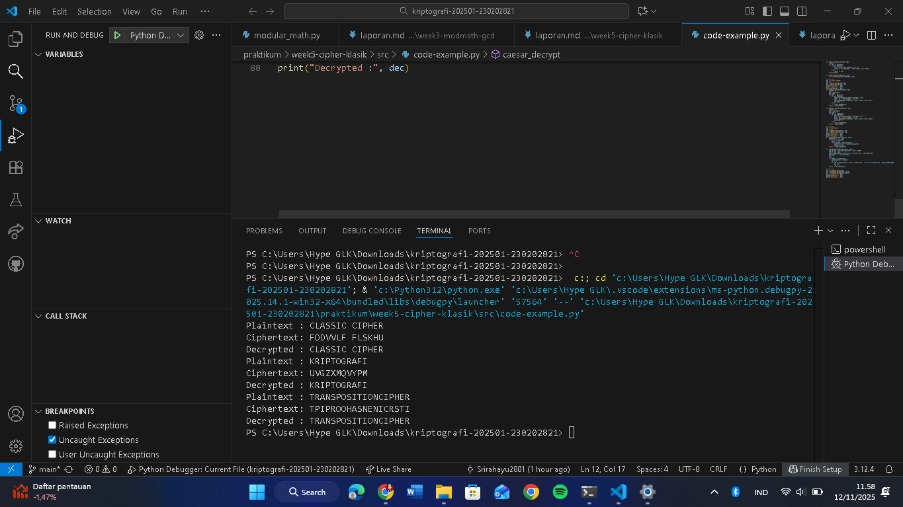

# Laporan Praktikum Kriptografi
Minggu ke-: 5 
Topik: [Cipher Klasik (Caesar, Vigenère, Transposisi)]  
Nama: [Sri Rahayu]  
NIM: [230202821]  
Kelas: 5IKRB 

---

## 1. Tujuan
Setelah mengikuti praktikum ini, mahasiswa diharapkan mampu:  
1. Menerapkan algoritma **Caesar Cipher** untuk enkripsi dan dekripsi teks.  
2. Menerapkan algoritma **Vigenère Cipher** dengan variasi kunci.  
3. Mengimplementasikan algoritma transposisi sederhana.  
4. Menjelaskan kelemahan algoritma kriptografi klasik.  

---

## 2. Dasar Teori
---

Cipher Klasik merupakan teknik kriptografi awal yang digunakan untuk menyembunyikan pesan dengan cara mengubah bentuk teks asli (plaintext) menjadi teks sandi (ciphertext) menggunakan aturan tertentu. Tujuan utamanya adalah menjaga kerahasiaan informasi agar tidak dapat dibaca oleh pihak yang tidak berwenang. Cipher klasik terbagi menjadi dua jenis utama, yaitu cipher substitusi (mengganti huruf dengan huruf lain) dan cipher transposisi** (menukar posisi huruf tanpa mengubah bentuk hurufnya).

Caesar Cipher adalah salah satu jenis cipher substitusi paling sederhana, di mana setiap huruf pada plaintext digeser sejauh beberapa huruf dalam alfabet. Misalnya, dengan pergeseran 3, huruf A menjadi D, B menjadi E, dan seterusnya. Proses ini dapat dituliskan dengan rumus *C = (P + k) mod 26*, di mana *C* adalah ciphertext, *P* adalah plaintext, dan *k* adalah nilai pergeseran.

Vigenère Cipher** merupakan pengembangan dari Caesar Cipher dengan menggunakan kunci berupa kata. Setiap huruf kunci menentukan besar pergeseran untuk huruf plaintext yang bersesuaian, sehingga pola pergeseran menjadi lebih kompleks dan sulit dipecahkan. Sementara itu, Cipher Transposisi tidak mengganti huruf, tetapi mengubah urutannya berdasarkan pola tertentu (seperti kolom atau baris), sehingga pesan asli menjadi acak. Ketiga metode ini menjadi dasar penting dalam perkembangan kriptografi modern karena memperkenalkan konsep enkripsi, dekripsi, dan kunci rahasia.

---

## 3. Alat dan Bahan
(- Python 3.x  
- Visual Studio Code / editor lain  
- Git dan akun GitHub  
- Library tambahan (misalnya pycryptodome, jika diperlukan)  )

---

## 4. Langkah Percobaan
(Tuliskan langkah yang dilakukan sesuai instruksi.  
Contoh format:
1. Membuat file `caesar_cipher.py` di folder `praktikum/week2-cryptosystem/src/`.
2. Menyalin kode program dari panduan praktikum.
3. Menjalankan program dengan perintah `python caesar_cipher.py`.)

---

## 5. Source Code
(Salin kode program utama yang dibuat atau dimodifikasi.  
Gunakan blok kode:

```python
def caesar_encrypt(plaintext, key):
    result = ""
    for char in plaintext:
        if char.isalpha():
            shift = 65 if char.isupper() else 97
            result += chr((ord(char) - shift + key) % 26 + shift)
        else:
            result += char
    return result

def caesar_decrypt(ciphertext, key):
    return caesar_encrypt(ciphertext, -key)

# Contoh uji
msg = "CLASSIC CIPHER"
key = 3
enc = caesar_encrypt(msg, key)
dec = caesar_decrypt(enc, key)
print("Plaintext :", msg)
print("Ciphertext:", enc)
print("Decrypted :", dec)
def vigenere_encrypt(plaintext, key):
    result = []
    key = key.lower()
    key_index = 0
    for char in plaintext:
        if char.isalpha():
            shift = ord(key[key_index % len(key)]) - 97
            base = 65 if char.isupper() else 97
            result.append(chr((ord(char) - base + shift) % 26 + base))
            key_index += 1
        else:
            result.append(char)
    return "".join(result)

def vigenere_decrypt(ciphertext, key):
    result = []
    key = key.lower()
    key_index = 0
    for char in ciphertext:
        if char.isalpha():
            shift = ord(key[key_index % len(key)]) - 97
            base = 65 if char.isupper() else 97
            result.append(chr((ord(char) - base - shift) % 26 + base))
            key_index += 1
        else:
            result.append(char)
    return "".join(result)

# Contoh uji
msg = "KRIPTOGRAFI"
key = "KEY"
enc = vigenere_encrypt(msg, key)
dec = vigenere_decrypt(enc, key)
print("Plaintext :", msg)
print("Ciphertext:", enc)
print("Decrypted :", dec)
def transpose_encrypt(plaintext, key=5):
    ciphertext = [''] * key
    for col in range(key):
        pointer = col
        while pointer < len(plaintext):
            ciphertext[col] += plaintext[pointer]
            pointer += key
    return ''.join(ciphertext)

def transpose_decrypt(ciphertext, key=5):
    num_of_cols = int(len(ciphertext) / key + 0.9999)
    num_of_rows = key
    num_of_shaded_boxes = (num_of_cols * num_of_rows) - len(ciphertext)
    plaintext = [''] * num_of_cols
    col = 0
    row = 0
    for symbol in ciphertext:
        plaintext[col] += symbol
        col += 1
        if (col == num_of_cols) or (col == num_of_cols - 1 and row >= num_of_rows - num_of_shaded_boxes):
            col = 0
            row += 1
    return ''.join(plaintext)

# Contoh uji
msg = "TRANSPOSITIONCIPHER"
enc = transpose_encrypt(msg, key=5)
dec = transpose_decrypt(enc, key=5)
print("Plaintext :", msg)
print("Ciphertext:", enc)
print("Decrypted :", dec)
```
)

---

## 6. Hasil dan Pembahasan
(- Lampirkan screenshot hasil eksekusi program (taruh di folder `screenshots/`).  
- Berikan tabel atau ringkasan hasil uji jika diperlukan.  
- Jelaskan apakah hasil sesuai ekspektasi.  
- Bahas error (jika ada) dan solusinya. 

Hasil eksekusi program Caesar Cipher:




)

---

## 7. Jawaban Pertanyaan
(Jawab pertanyaan diskusi yang diberikan pada modul.  
- Pertanyaan 1: Kelemahan utama Caesar Cipher adalah tingkat keamanannya yang sangat rendah karena hanya menggunakan satu kunci pergeseran tetap. Pola huruf yang berulang membuat cipher ini mudah dipecahkan menggunakan analisis frekuensi atau dengan mencoba seluruh kemungkinan pergeseran (hanya 25 kemungkinan). Sementara itu, Vigenère Cipher memang lebih kuat dibanding Caesar karena menggunakan kunci berupa kata, namun tetap memiliki kelemahan jika kuncinya pendek atau berulang. Pola pergeseran yang berulang ini dapat dimanfaatkan oleh penyerang menggunakan analisis frekuensi dan metode Kasiski untuk menemukan panjang kunci, sehingga pesan dapat diuraikan.

- Pertanyaan 2: Cipher klasik mudah diserang dengan analisis frekuensi karena pola kemunculan huruf pada teks sandi masih mencerminkan pola huruf pada bahasa aslinya. Dalam bahasa tertentu (seperti bahasa Indonesia atau Inggris), beberapa huruf muncul lebih sering daripada yang lain — misalnya huruf *E* atau *A*. Pada cipher klasik seperti Caesar dan Vigenère dengan kunci pendek, pola frekuensi ini tidak berubah secara signifikan setelah proses enkripsi. Akibatnya, penyerang dapat membandingkan distribusi huruf pada ciphertext dengan frekuensi huruf umum suatu bahasa untuk menebak huruf-huruf aslinya, sehingga pesan dapat dipecahkan tanpa mengetahui kunci sebenarnya.

- Pertanyaan 3:Berikut perbandingan kelebihan dan kelemahan cipher substitusi dan transposisi

Cipher Substitusi

Kelebihan:

* Proses enkripsi dan dekripsi sederhana serta mudah diterapkan.
* Dapat menghasilkan ciphertext yang berbeda jauh dari plaintext karena setiap huruf diganti dengan simbol lain.

Kelemahan:

* Pola frekuensi huruf tetap terlihat, sehingga mudah diserang menggunakan analisis frekuensi.
* Jika kunci diketahui sebagian, sisa pesan bisa dengan cepat diuraikan.
* Keamanannya rendah untuk penggunaan modern.

Cipher Transposisi

Kelebihan:

* Tidak mengubah huruf asli, hanya menukar urutannya sehingga frekuensi huruf tetap sama namun urutan acak, membuatnya agak lebih sulit dianalisis langsung.
* Lebih aman dibanding substitusi sederhana jika pola penyusunan cukup kompleks.

Kelemahan:

* Jika pola atau panjang kunci diketahui, pesan mudah dipecahkan.
* Tidak menyamarkan frekuensi huruf, sehingga analisis statistik lanjutan masih bisa digunakan.
* Lebih sulit diterapkan secara manual dibanding cipher substitusi sederhana.

)
---

## 8. Kesimpulan
Berdasarkan percobaan yang dilakukan, dapat disimpulkan bahwa cipher klasik seperti Caesar, Vigenère, dan Transposisi mampu mengamankan pesan dengan cara menyembunyikan makna asli melalui proses enkripsi sederhana. Setiap metode memiliki karakteristik berbeda dalam penggunaan kunci dan pola penyandian, namun sama-sama bertujuan menjaga kerahasiaan informasi. Meskipun tergolong mudah dipecahkan dengan teknologi modern, cipher klasik tetap penting sebagai dasar pemahaman konsep kriptografi.


---

## 9. Daftar Pustaka
(Cantumkan referensi yang digunakan.  
Contoh:  
- Katz, J., & Lindell, Y. *Introduction to Modern Cryptography*.  
- Stallings, W. *Cryptography and Network Security*.  )

---

## 10. Commit Log

```
commit ab497ef2879f36dc1e6eb2ba09d2b6d3637f5d09 (HEAD -> main, origin/main, origin/HEAD)
Author: Srirahayu2801 <ayu167580@gmail.com>
Date:   Wed Nov 12 11:44:29 2025 +0700

    week5-cipher-klasik

```
